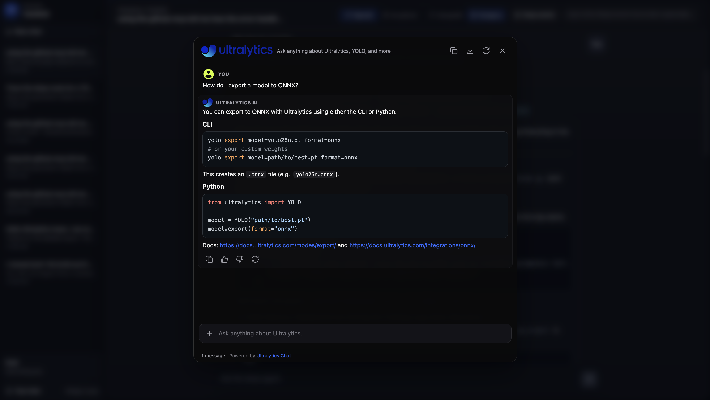
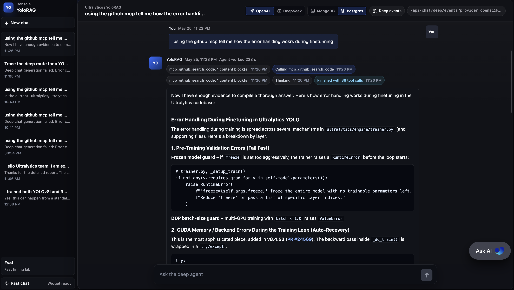
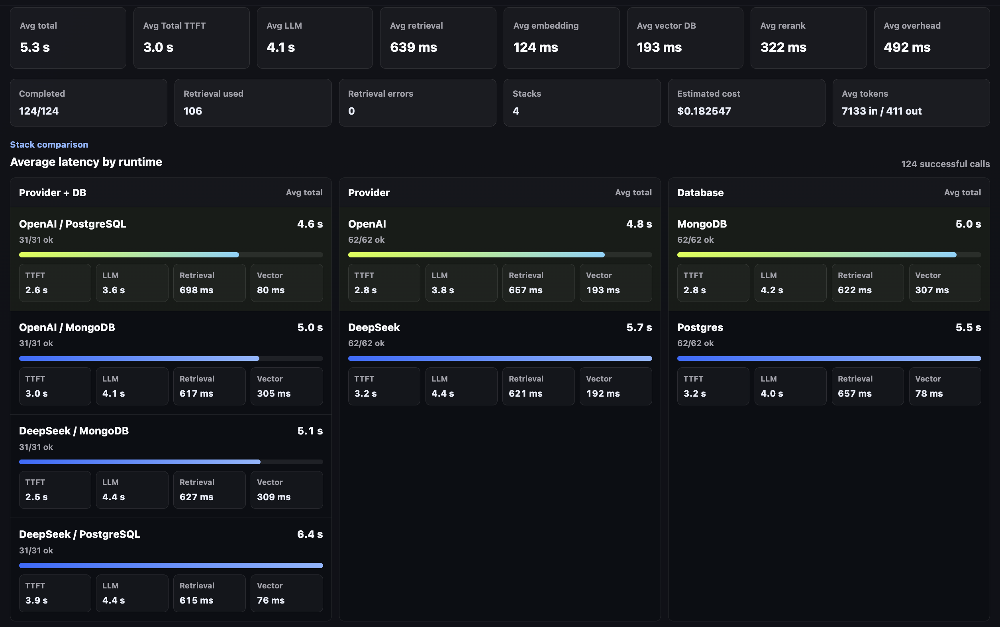
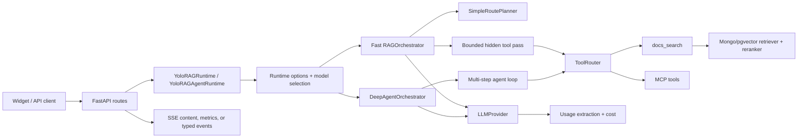

# YoloRAG: Ultralytics Support Triage Agent

Javier Chulvi Bernad | Deployed app: <https://yolo.chulvi.dev/>

YoloRAG is my provider-agnostic RAG orchestrator for the Ultralytics LLM
Engineer take-home challenge. It is a FastAPI backend with a small Vite/React
frontend to test the fast chatbot and the deep-agent console.

What it shows:

- Provider adapters hide vendor-specific response shapes.
- Usage and cost are normalized across providers.
- Retrieval is selective, score-gated, and safe to skip.
- Fast chat can run one bounded hidden tool-selection pass, then streams the
  final answer token by token.
- Deep chat can run richer multi-step docs, MCP, and GitHub investigation before
  returning a final answer.
- The API stays widget-compatible without leaking routing or tool mechanics into
  prompts.

## Fast Chat Path



Fast chat is the low-latency path behind `POST /api/chat/fast`; `POST /api/chat`
is kept as the backwards-compatible alias. It uses the configured provider's
fast model, defaulting to `gpt-5.4-mini` for OpenAI and `deepseek-v4-flash` for
DeepSeek, with model selection controlled by environment variables.

The architecture is intentionally short: widget or API client -> FastAPI route
-> `YoloRAGRuntime` -> `RAGOrchestrator` -> provider streaming response. Before
the final answer streams, the orchestrator can run one hidden tool-selection
pass. The normal fast tool is `docs_search`, capped to a small result set,
score-gated by `YOLORAG_RETRIEVAL_MIN_SCORE`, and bounded by
`YOLORAG_FAST_TOOL_TIMEOUT_SECONDS`. If retrieval or tool selection fails, the
answer degrades to LLM-only instead of breaking the chat.

Fast tool and retrieval mechanics stay hidden from the public SSE stream. The
client sees normal answer tokens and, when explicitly requested by the eval
runner, a final metrics event.

## Deep Agent Path



Deep agent is the quality-first path for GitHub issues, support threads, and
debugging tasks. `POST /api/chat/deep` returns only the final text answer, while
`POST /api/chat/deep/events` streams typed console events such as `status`,
`tool_call`, `tool_result`, `content`, and `done`.

The deep runtime uses the configured provider's thinking model, defaulting to
`gpt-5.5` for OpenAI and `deepseek-v4-pro` for DeepSeek. Its architecture is:
FastAPI route -> `YoloRAGAgentRuntime` -> `DeepAgentOrchestrator` -> provider
tool-calling loop -> `ToolRouter`. The tool router exposes `docs_search` plus
configured MCP tools. When `GITHUB_MCP_TOKEN` is set, the built-in hosted GitHub
MCP setup keeps calls read-only and locally enforces `ultralytics/ultralytics`,
so repository evidence is available without broad repo discovery.

This path can spend multiple bounded steps gathering docs, code, issue, or pull
request evidence before writing the final maintainer-style reply. Tool failures
are surfaced in the console stream and handled gracefully by the agent.

## Eval Page



The eval page exists to compare the two choices that matter most in this
product: LLM provider and retrieval backend. OpenAI and DeepSeek have different
latency profiles, token accounting, and reasoning controls, while MongoDB Atlas
and PostgreSQL/pgvector answer the same documentation questions with different
retrieval work split between the app and the database.

MongoDB Atlas performs query embedding inside the vector-search request, then
the app reranks the candidates and sends only the best chunks to the LLM.
PostgreSQL/pgvector is more app-owned: the app embeds the user query first,
searches the local pgvector table, then calls the same reranker before sending
context to the LLM.

The frontend eval page runs the same question set across provider/database
combinations and compares total latency, TTFT, LLM time, query embedding time,
vector search time, rerank time, retrieval quality, token usage, and estimated
cost.

## Why The Design Matters

The eval page is not only a benchmark screen. It exercises the main modular
contracts in the backend and makes the tradeoffs visible.

### LLM Provider Modularity

The LLM layer uses a small factory pattern instead of letting API routes import
vendor SDKs directly. `runtime.py` decides the provider name from
`YOLORAG_API_PROVIDER` or request query parameters, resolves the mode-specific
model through `_resolve_model()`, then asks `providers/factory.py` for an
`LLMProvider`.

`providers/factory.py` is the registry point:

- `PROVIDERS` maps provider names such as `openai` and `deepseek` to builder
  functions.
- each builder owns provider-specific credentials and base URL selection.
- `get_llm_provider()` normalizes the requested name, validates it, and returns
  an object that implements the shared provider protocol.

The rest of the backend only depends on the `LLMProvider` protocol from
`providers/base.py`: `complete()` for full responses and `stream_complete()` for
true token streaming. Both methods exchange normalized `LLMRequest`,
`LLMResponse`, and `LLMStreamEvent` objects. That is the important boundary:
fast chat, deep agent mode, tool calls, usage extraction, cost tracking, latency,
and optional reasoning content all use one internal shape even when the vendor
APIs differ.

OpenAI is the base OpenAI-compatible transport in `OpenAIProvider`. It owns the
`AsyncOpenAI` client, streaming usage collection, GPT reasoning/verbosity
request controls, tool-call request formatting, and conversion from raw SDK
responses into `LLMResponse`. `DeepSeekProvider` subclasses that transport
because DeepSeek is OpenAI-compatible, but overrides `_completion_kwargs()` to
set the DeepSeek base URL and provider-specific thinking controls: fast mode
disables thinking, while deep mode enables high reasoning effort.

To add another provider, the intended change is narrow: add a provider adapter,
add or reuse a usage extractor, add pricing coverage when needed, register a
builder in `PROVIDERS`, and add model defaults or env overrides. The chat routes,
fast orchestrator, deep orchestrator, eval runner, and tool router should not
need to know the provider's raw response format.

### Database Modularity

Knowledge storage is selected through `YOLORAG_KNOWLEDGE_PROVIDER` or request
query parameters, with MongoDB and PostgreSQL/pgvector behind the same
`KnowledgeStore` and retrieval interfaces. That lets the same question set run
against different vector stores without changing the chat API.

This matters because the stores do different work. MongoDB Atlas can own more of
the vector-search flow, while PostgreSQL/pgvector keeps embedding and query
control closer to the app. The shared retrieval trace makes those differences
measurable instead of hidden behind a single "RAG latency" number.

### Cost Tracking And Profiling

Cost tracking is owned by the app, not by the chat routes. Provider adapters
extract raw usage into `TokenUsage`, including input tokens, output tokens,
cached input tokens, cache-write tokens, and reasoning tokens when the provider
reports them. The orchestrators carry that normalized usage through
`OrchestrationTrace`, and fast eval requests can expose it in the final `metrics`
SSE event.

`CostCalculator` then prices the normalized usage in two stages. First it checks
the repo-local `PricingRegistry`, which loads `usage/pricing.json` and is useful
for explicit overrides or private model prices. If there is no local match, it
falls back to Pydantic's [`genai-prices`](https://github.com/pydantic/genai-prices)
package. That third-party project provides `Usage` and `calc_price()` helpers
for estimating LLM inference API prices across providers. The README for
`genai-prices` describes it as a best-effort estimate, so YoloRAG stores the
pricing source on each `CostBreakdown` instead of pretending the number is a
bill-perfect charge.

The profiling side is deliberately more detailed than a single latency number.
`OrchestrationTrace` records total latency, TTFT, LLM time, query embedding,
vector search, rerank, orchestration overhead, retrieval candidate counts,
returned context counts, token usage, estimated cost, pricing source, and
retrieval errors. That breakdown is how I studied where issues came from:
provider latency, database search, reranking, query embedding, hidden tool
selection, cost growth, or plain app overhead. It also keeps model/provider
comparisons honest because speed, quality, and cost can be compared together.

### API Contracts And Failure Handling

The API stays stable around the product surfaces: fast chat streams real SSE
tokens, deep chat can return only final text, and the deep console can subscribe
to typed agent events. Routing and tool mechanics stay internal so the widget
does not expose implementation labels to the user.

Retrieval and tool failures are treated as degraded context, not hard chat
failures. If docs search, reranking, or an MCP tool fails, the trace records the
problem and the model can still answer from the conversation and its base
knowledge.

### Tool And MCP Boundaries

`docs_search` is the default documentation tool, with score-gated results and
small fast-path limits. Deep mode can use richer docs and MCP tools over
multiple steps. Hosted GitHub MCP is configured read-only in code when
`GITHUB_MCP_TOKEN` is present, and repository access is locally constrained to
`ultralytics/ultralytics`.

### Conversation And Auditability

Conversation history is passed through the API payload and persisted through the
configured conversation logger. Persisted assistant turns include provider,
model, and retrieved document IDs, which makes it possible to audit which model
and evidence influenced an answer. When `raw_user_message` is available, routing
and retrieval use that clean user turn rather than widget page context or added
instructions.

### Review Discipline

Fast mode avoids a second LLM critique pass because it would work against the
latency goal. Deep mode adds stronger verification behavior through the
maintainer operating protocol in `core/agent.py`: classify the thread type,
identify the thread stage, gather bounded evidence, distinguish root causes from
workarounds, and avoid inventing versions, dates, paths, metrics, commands, or
error text.

## Architecture

`api/` owns FastAPI routes, request schemas, runtime selection, and SSE
formatting.

`runtime.py` wires provider, model, knowledge store, conversation store,
retriever, tool router, and the selected fast or deep orchestrator.

`core/` owns routing, conversation state, fast orchestration, deep-agent
orchestration, transcript persistence, and traces.

`providers/` owns model API calls, the registry-backed provider factory, and
response normalization into `LLMResponse`.

`usage/` owns provider-specific token extraction and cost calculation.

`knowledge/` and `retrieval/` own document storage, vector search, optional
reranking, retrieval traces, and the common `Retriever` protocol.

`tools/` owns `docs_search`, MCP discovery, MCP allowlist enforcement, dynamic
tool discovery, and tool routing.



## What I Assumed

- The backend is the main deliverable. The frontend is a local test harness.
- Provider and model selection are environment-driven.
- OpenAI and DeepSeek are the runnable providers in this repo. DeepSeek uses an
  OpenAI-compatible transport with provider-specific thinking controls.
- MongoDB Atlas and PostgreSQL/pgvector are supported knowledge-store options.
  If retrieval fails, the answer still runs LLM-only.
- Fast routing uses the raw latest user message when available.
- GitHub MCP is read-only in the documented setup and is locally constrained
  with `allowed_repositories`.

## Quick Start With Docker Images

This is the fastest way to run the whole demo. Docker Compose builds the
backend and frontend images, starts the public `pgvector/pgvector:pg17` image,
and serves the frontend on `http://127.0.0.1:8080`.

```bash
cp .env.example .env
```

Fill at least these values in `.env`:

```env
OPENAI_API_KEY=
DEEPSEEK_API_KEY=
YOLORAG_MONGODB_URI=
YOLORAG_MONGODB_AI_API_KEY=
SERVICE_PASSWORD_POSTGRES=yolorag
```

Start the stack:

```bash
docker compose --env-file .env \
  -f docker/docker-compose.coolify.yml \
  -f docker/docker-compose.local.yml \
  up -d --build
```

Then open `http://127.0.0.1:8080`. The backend is also exposed at
`http://127.0.0.1:8000`.

## Local Python Setup

```bash
python3 -m venv .venv
source .venv/bin/activate
python -m pip install -e .[dev]
```

Configure the provider credentials you plan to use in `.env` or in your shell:

```env
YOLORAG_API_PROVIDER=deepseek
DEEPSEEK_API_KEY=...
OPENAI_API_KEY=...
YOLORAG_KNOWLEDGE_PROVIDER=mongodb
```

For MongoDB Atlas eval runs, fast chat keeps docs search bounded with these
optional defaults:

```env
YOLORAG_FAST_TOOL_TIMEOUT_SECONDS=8
YOLORAG_FAST_RERANK_CANDIDATE_LIMIT=16
```

If `docs_search` times out, the answer still streams LLM-only and the eval
metrics report it under retrieval errors instead of failing the request.

## Run The Chat API

The FastAPI app exposes the widget chat contract at `POST /api/chat/fast`.
`POST /api/chat` remains as a legacy alias for the fast route. Fast chat can use
one short hidden tool-selection pass for docs or configured MCP tools when that
materially improves the answer, then streams only normal content SSE. Widget page
context and widget instructions are accepted by the request schema but are not
added to the model prompt in this demo build; routing and retrieval decisions use
the raw latest user message. Deep agent mode is available at `POST /api/chat/deep`
and returns only the final text response after the agent finishes any docs or MCP
tool calls.
`POST /api/chat/deep/events` streams the same deep-agent run as Server-Sent Events,
including `status`, `tool_call`, `tool_result`, `content`, and `done` payloads
for the local console.

```bash
PYTHONPATH=src uvicorn yolorag.api.app:app --reload --host 127.0.0.1 --port 8000
```

Quick smoke test:

```bash
curl -N http://127.0.0.1:8000/api/chat/fast \
  -H "Content-Type: application/json" \
  -d '{"messages":[{"role":"user","content":"Explain YOLO in one paragraph"}]}'
```

The endpoint returns Server-Sent Events and an `X-Session-ID` header. Send that
same session ID on the next request to reuse the in-memory conversation history.

## Hosted MCP Servers

Fast and deep chat can load the built-in hosted GitHub MCP tools when
`GITHUB_MCP_TOKEN` is set. The server URL, read-only headers, toolsets, and
repository allowlist are configured in code so deployment environments do not
need to carry a large JSON blob.

Hosted GitHub MCP:

```env
GITHUB_MCP_TOKEN=...
```

`X-MCP-Readonly` keeps GitHub tool calls read-only, while `X-MCP-Toolsets`
narrows the exposed tools to the issue-troubleshooting surface.
The `ultralytics/ultralytics` allowlist is enforced locally before tool calls
leave the app.

## Run The Frontend

The local frontend lives in `frontend/`. It uses Vite, React, Tailwind CSS, and
the copied widget bundle at `frontend/public/vendor/ultralytics-chat.js`.

```bash
cd frontend
npm install
npm run sync:llm
npm run dev
```

By default, Vite proxies `/api/*` to `http://127.0.0.1:8000`, so the widget can call `/api/chat/fast` while the FastAPI server uses the real configured provider.

`npm run sync:llm` refreshes `frontend/public/vendor/ultralytics-chat.js` from
the sibling `../llm/js/chat.js` contract. The bundle is included for demo/server
deploys, so refresh it before building if the sibling widget changes.

Use a real provider for local chat testing:

```bash
YOLORAG_API_PROVIDER=openai \
OPENAI_API_KEY=... \
PYTHONPATH=src uvicorn yolorag.api.app:app --reload --host 127.0.0.1 --port 8000
```

## Quick Checks

Run the backend tests:

```bash
PYTHONPATH=src python3 -m unittest discover -s src/yolorag/tests
```

Smoke-test the fast path:

```bash
curl -N http://127.0.0.1:8000/api/chat/fast \
  -H "Content-Type: application/json" \
  -d '{"messages":[{"role":"user","content":"Explain YOLO in one paragraph"}]}'
```

Smoke-test the deep event stream:

```bash
curl -N http://127.0.0.1:8000/api/chat/deep/events \
  -H "Content-Type: application/json" \
  -d '{"messages":[{"role":"user","content":"Explain how YOLO handles object detection"}]}'
```

Build the frontend harness:

```bash
cd frontend
npm install
npm run sync:llm
npm run build
```

Run the latency profile after provider and retrieval credentials are configured:

```bash
PYTHONPATH=src python -m yolorag.scripts.eval_profile_latency --top-k 8 --mode fast
```

## Model Defaults

The API picks models by provider and mode. Model names can only be configured through environment variables for now. If no env override is present, the built-in defaults are used.

Override order:

1. Mode-specific env vars, such as `YOLORAG_OPENAI_FAST_MODEL`
2. Legacy provider env vars, such as `YOLORAG_OPENAI_MODEL`
3. Built-in defaults

| Provider | Fast mode | Deep/thinking mode |
| --- | --- | --- |
| OpenAI | `gpt-5.4-mini` | `gpt-5.5` |
| DeepSeek | `deepseek-v4-flash` | `deepseek-v4-pro` |

Use environment overrides:

```env
YOLORAG_OPENAI_FAST_MODEL=gpt-5.4-mini
YOLORAG_OPENAI_THINKING_MODEL=gpt-5.5
YOLORAG_DEEPSEEK_FAST_MODEL=deepseek-v4-flash
YOLORAG_DEEPSEEK_THINKING_MODEL=deepseek-v4-pro
```

DeepSeek fast mode explicitly disables thinking. DeepSeek deep mode enables thinking with high reasoning effort.

## Retrieval And Tool Tuning

Fast chat uses one bounded hidden tool-selection pass and then streams the final
answer. The fast `docs_search` tool is capped in code to 3 results. Retrieved
content is score-gated with the shared relevance threshold; low-confidence
matches are filtered out instead of being injected into the final answer path.
Deep chat applies the same relevance threshold to richer `docs_search` tool
results. This avoids hard-coded keyword routing while keeping retrieved context
quality-gated.

```env
YOLORAG_RETRIEVAL_MIN_SCORE=0.50
```

## Docker And Coolify Notes

The Coolify deployment lives in `docker/docker-compose.coolify.yml`. It builds separate
backend and frontend images, runs `pgvector/pgvector:pg17`, and loads the
precomputed PostgreSQL embeddings from `deploy/postgres/init/010_docs_chunks.sql.gz`
on first database initialization.

Regenerate that seed from the local pgvector database:

```bash
PYTHONPATH=src python -m yolorag.scripts.export_postgres_seed
```

Local smoke test without the earlier quick-start section:

```bash
SERVICE_PASSWORD_POSTGRES=yolorag docker compose --env-file .env \
  -f docker/docker-compose.coolify.yml \
  -f docker/docker-compose.local.yml \
  up -d --build
```

The frontend is served on `http://127.0.0.1:8080` and proxies `/api/*` to the
backend. MongoDB remains an external Atlas-backed provider; the compose stack
does not run a local MongoDB because this demo uses Atlas vector search.

See `deploy/README.md` for the Coolify environment variables and seed refresh
notes.

## Latency Evals

Run the profile questions against MongoDB retrieval only:

```bash
PYTHONPATH=src python -m yolorag.scripts.eval_profile_latency --retrieval-only
```

Compare smaller rerank candidate pools:

```bash
PYTHONPATH=src python -m yolorag.scripts.eval_profile_latency --retrieval-only --rerank-candidates 32
PYTHONPATH=src python -m yolorag.scripts.eval_profile_latency --retrieval-only --rerank-candidates 16
```

Run the same questions through the full RAG path, including the configured LLM:

```bash
PYTHONPATH=src python -m yolorag.scripts.eval_profile_latency --top-k 8 --mode fast
```

Each run prints Mongo vector search, reranking, time to first token, LLM, and
app-overhead timings, then writes a JSON report under `evals/runs/`.

The frontend eval panel imports `frontend/src/evals/profile_questions.json` and calls
`/api/chat/fast` directly in batches of five. Eval requests opt into final SSE
metrics and set `analytics=false` so benchmark traffic stays transient.
Dispatcher smoke test — please ignore.
